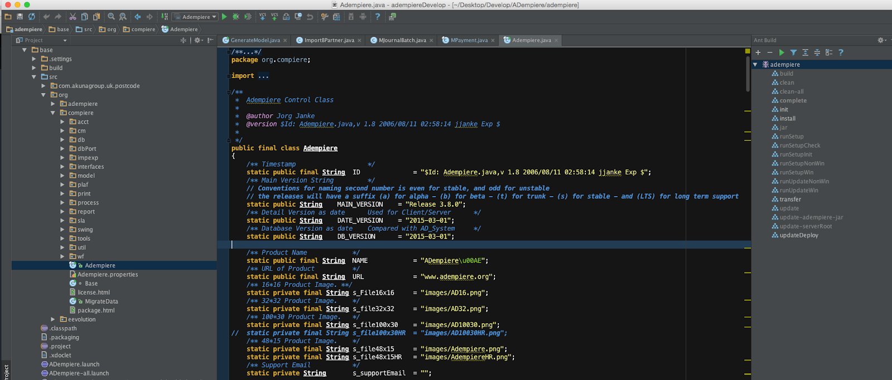

    ADempiere Project Repository 


    The ADempiere main repository can be found in GitHub at [https://github.com/ADempiere/ADempiere](https://github.com/ADempiere/ADempiere).


    Before proceeding, please refer to the [Git SCM Documentation](http://git-scm.com/doc).


    To collaborate with the ADempiere team, we use the Git Hub Fork and Pull model. From the [GitHub website](https://help.github.com/articles/using-pull-requests/#fork--pull):


    The fork & pull model lets anyone fork an existing repository and push changes to their personal fork without requiring access be granted to the source repository. The changes must then be pulled into the source repository by the project maintainer. This model reduces the amount of friction for new contributors and is popular with open source projects because it allows people to work independently without upfront coordination.


    Refer to the GitHub article on [Pull Requests](https://help.github.com/articles/using-pull-requests) for more information and instructions on how to get started.

    Summary Instructions 


    The setup is easy. Follow these steps:

*   **Install the Git Software.** You can work with the Git command line or any of a number of Git GUI tools. As the repository is on GitHub, it is recommended to follow the [GitHub setup procedures](https://help.github.com/articles/set-up-git/).
*   Create a GitHub account
*   [Create your personal fork](https://help.github.com/articles/fork-a-repo/) of the ADempiere project
*   Create a local clone of your personal fork
*   Start developing! 
*   Commit your work to your own fork. Follow the ADempiere [Software Development Procedure](http://www.ADempiere.com/Software_Development_Procedure) for branch naming.
*   Send a pull request to the ADempiere project.

     
    Cloning a Repository 


    Cloning a repository to your local computer is simple. Follow the instructions with the GitHub software or your GUI tool, many of which allow for cloning a GitHub repository to a local computer with a few mouse clicks. If you want to do it from the command line,


    ```
- Navigate to the parent directory where the repository will be placed and type the following command
C:\dev\repos\github>git clone [url]
    ```

    This will create a directory using the url project name, initialize a .git directory inside it, pull down all the data for that repository, and check out a working copy of the latest version. If you go into the new directory, you'll see the project files in there, ready to be worked on or used.


    To change the name of clone directory use the following


    ```
- Navigate to the parent directory where the repository will be placed and type the following command
C:\dev\repos\github>git clone [url] <optional name>
    ```

### 
    **Cloning the Repository with a Slow Connection **


    To clone a repository over a slow or intermittent Internet connection, try using git fetch instead of clone as follows:


    ```
- Create a directory for the repo and change to it
C:\dev\repos\github>mkdir ADempiere

C:\dev\repos\github>cd ADempiere

- Initialize the repository
C:\dev\repos\github\ADempiere>git init
Initialized empty Git repository in C:/dev/repos/github/ADempiere/.git/

- The default reference to the source repository in a clone is "origin".  Clone your
- personal fork from your account <account>.
C:\dev\repos\github\ADempiere>git remote add origin https://github.com/<account>/ADempiere.git

- Fetch the contents.
C:\dev\repos\github\ADempiere>git fetch

- Update to the current master branch - for example
C:\dev\repos\github\ADempiere>git reset --hard origin/master


<table>
  <tr>
  </tr>
</table>